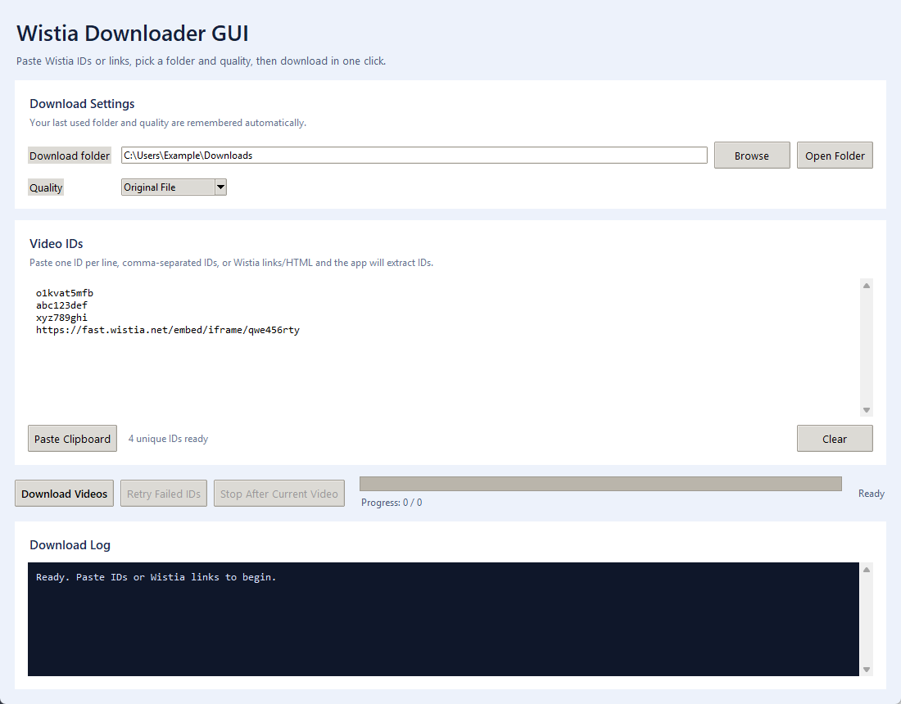
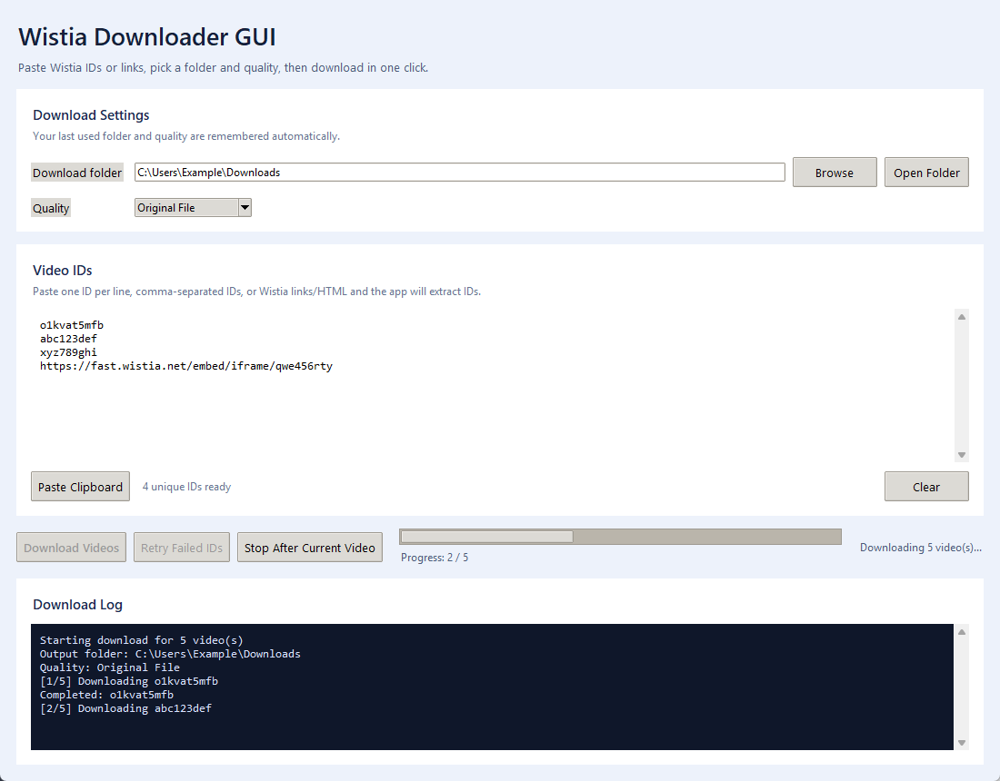
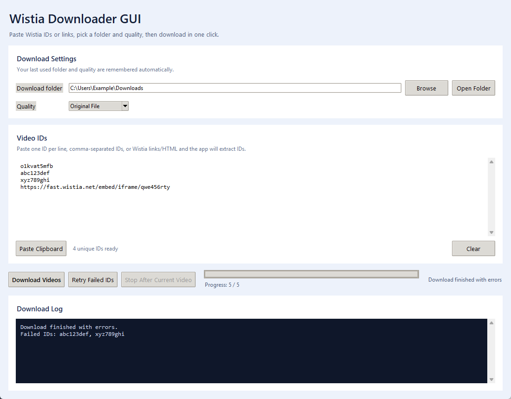

# Wistia Bulk Downloader GUI

Public fork of [aladagemre/wistia-downloader](https://github.com/aladagemre/wistia-downloader) with a Windows GUI, bulk paste workflow, retry support, and a packaged `.exe` release. The GUI layer in this fork was made with GPT-5.4.

## What It Does

- Paste Wistia IDs in bulk
- Accept direct IDs, Wistia links, or pasted HTML containing `wvideo=...`
- Pick the download folder from the app
- Choose output quality, including `Original File`
- Retry only the failed IDs from the previous batch
- Show a live log and overall progress while downloads run

## Defaults

- Download folder: the current user's standard `Downloads` folder
- Quality: `Original File`

The GUI remembers your last used folder and quality automatically.

## Launch

### Download the EXE

- Latest release: [v1.0.0](https://github.com/AmirMDEV/wistia-bulk-downloader-gui/releases/tag/v1.0.0)
- Direct download: [WistiaDownloaderGUI.exe](https://github.com/AmirMDEV/wistia-bulk-downloader-gui/releases/download/v1.0.0/WistiaDownloaderGUI.exe)

### Run from source

```powershell
pythonw .\wistia_gui.pyw
```

### Windows launcher

Double-click `Launch Wistia Downloader GUI.cmd`.

## Screenshots

Main window: bulk paste box, folder picker, and quality selection.



Download in progress: live log, progress bar, and stop control.



Retry failed IDs: post-run failure state with one-click retry.



## Build The EXE

```powershell
.\build_exe.ps1 -Clean
```

The packaged app is written to `dist\Wistia Downloader GUI.exe`.

## Notes

- The original CLI remains available in `wistia.py`
- The GUI uses the local downloader module directly instead of scraping terminal output
- Build outputs stay out of source control and the `.exe` is intended to ship as a release asset

